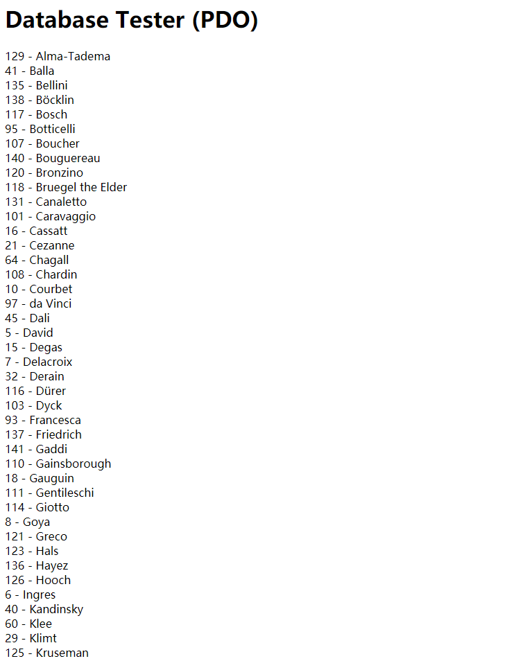
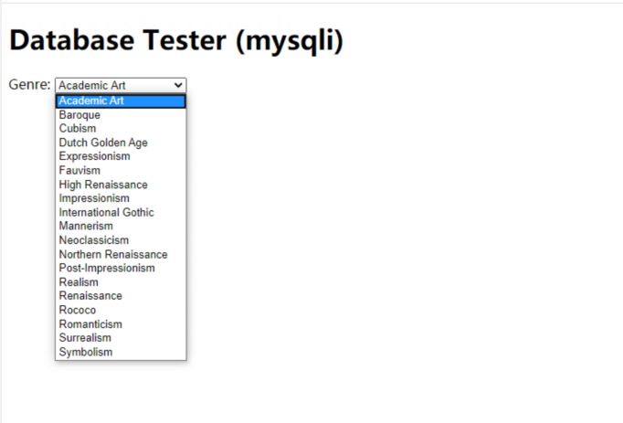
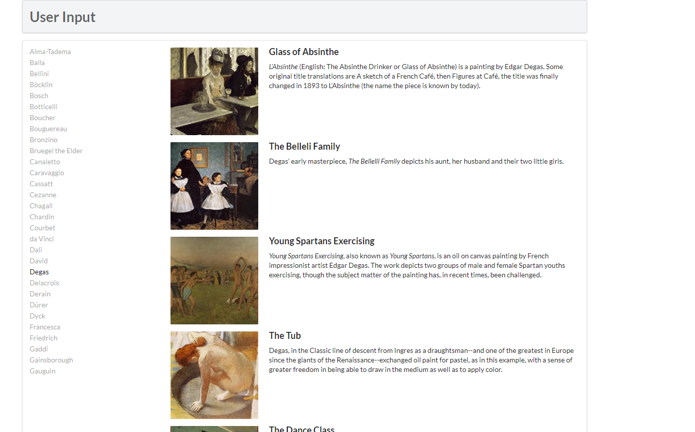

# LAB 10 
## 个人信息
姓名：李臻欣  
学号：19302010007  
github地址：https://github.com/woxihuanjiangguo/SOFT130002_lab
## Ex.7--Ex.10
### Ex.7
PDO部分
  
config文件中用define方法设置数据库的几个属性为常量，便于之后文件的调用。
先创建一个PDO对象，将需要使用的数据库属性赋到其中，随后用setAttribute方法将错误处理模式变为异常模式，便于错误的处理。
指定sql语句为select语句，对数据库进行查询，把结果赋给$result，再用fetch方法循环逐个输出数据库查询到的结果。
  
mysqli部分

先用面向过程的方法建立与数据库的连接，if语句处理连接错误。随后指定sql语句为select语句，把查询结果赋值给$result，并用mysqli_fetch_assoc方法逐个输出结果，把GenreID赋值给option元素的value，把GenreName赋值给option元素的innerhtml，最后释放内存，关闭连接。此时动态生成的option元素进入html的select元素中。
### Ex.8

outputArtists()：  
此部分从artists表中筛选30个人，按照Lastname进行排序，把一个动态生成的url赋值给一个a标签，url中？后面为一个id=数据库中的ArtistID。同时将其类设置为active item，改变a标签选中后的样式。此部分用来生成艺术家名字对应的a标签。  

outputPaintings()：  
用_GET获取当前url中的id值，并写出此时需要的sql语句，即Paintings表中ArtistId外键和id值相等的条目，随后用一次循环，对找到的条目运行一次outputSinglePainting函数，输出每一副画。  

outputSinglePainting：此部分主要设置html中显示的样子，与服务器相关的是对应文件路径，标题与摘录。  

### Ex.9
1.使用executeLargeUpdate方法执行DDL和DML语句  
2.使用execute方法执行SQL语句  
3.使用PreparedStatement执行SQL语句    
预处理好处：  
使用预处理：预编译sql语句，使得性能更好。能够无需拼接sql语句，使得编程容易。防止sql注入。
