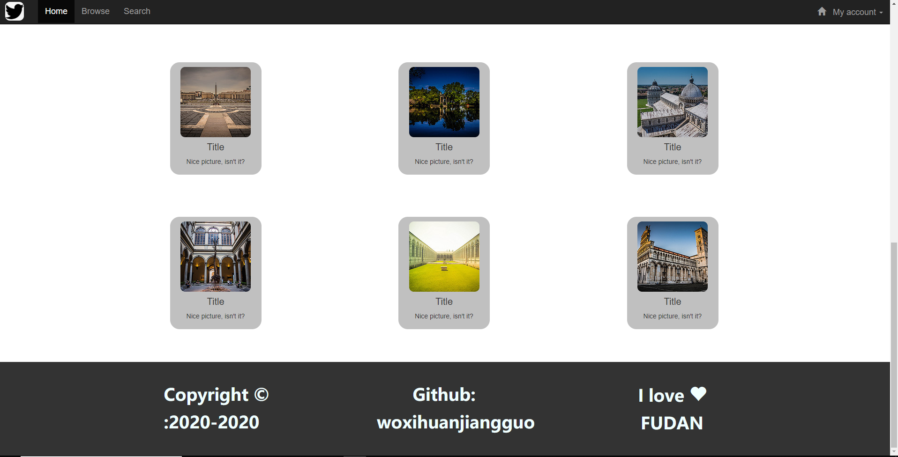

Lab4设计文档
====================
## 作业网址  
https://github.com/woxihuanjiangguo/SOFT130002_lab/tree/master/lab4

## 导航栏

使用bootstrap中的navbar这一类，其中加了一个可响应设备宽度的navbar-collapse类的div。并且在  
其中加入了两个navbar-nav的ul，分别为左边的三个导航条目与主页图标，以及最靠右的用户条目。  
对于用户条目中，有dropdown-menu的ul，用于显示点击my account条目下拉菜单。  

作为装饰，加入了一些glyphicon图标，也是bootstrap中现有的类。  

## carousel轮播图

在导航栏下写了一个container，其中照着模板样式，运用一个carousel-indicators类的ol，与carousel-inner  
类的div实现轮播图下方按钮与图片的承载。左右两边的箭头则是用carousel-control类的a标签，加上现有的  
glyphicon图标实现。  
效果见上图

## 缩略图部分

用thumnail实现，用bootstrap的栅格系统实现对各个thumbnail的排布，用index.css自己稍微调整样式即可。

## 页脚部分

同样用container作为容器，用栅格系统实现对各个文字部分的排布。略微粗糙。^_^

