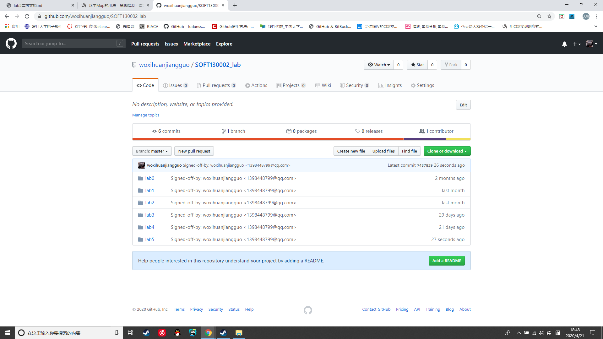
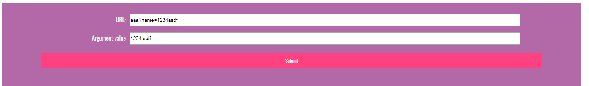
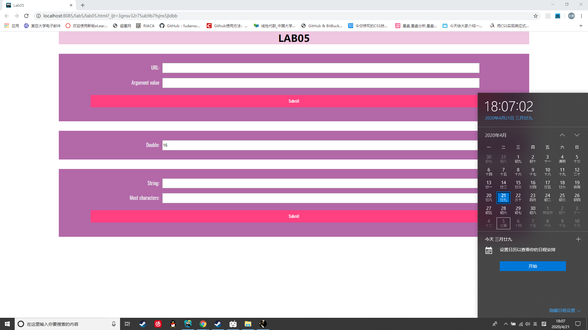

# lab5设计文档
## 基本信息

学号：19302010007  
姓名：李臻欣  
github地址：https://github.com/woxihuanjiangguo/SOFT130002_lab/tree/master/lab5
## 设计思路
### 问题1
关键部分代码
```javascript
function showWindowHref(){
    //取出问号后面的部分，再取出&分割下来的部分
    let urlElement = url.value.split("?")[1].split("&");
    let name;
    for(let i = 0;i < urlElement.length;i++){
        //取出name=后面的部分
        if(urlElement[i].match("\^name=")){
            name = urlElement[i].split("=")[1];
        }
    }
    if(name!=null)
        url_result.value= name;
}
```
先用两次split取出？部分被&分割的部分  
再用正则表达式判断被分割的部分是否以name开头  
最后赋值    

截图  


### 问题2
关键部分代码
```javascript
function timeTest(){
    let currentDate = new Date();
    let currentSecond = currentDate.getSeconds();
    //判断次数，十次后不赋值
    if(currentSecond!==0&&runNum<10){
        runNum++;
        mul.value*=2;
    }
}
//整数分钟停止每1000ms判断一次
function timeCheck(){
    if(new Date().getSeconds()===0){
        clearInterval(clock);
    }
}
let clock = setInterval(timeTest,5000);
setInterval(timeCheck,1000);
```
设置了两个函数，前一个用以判断累加次数并赋值，每五秒执行一次;  
后一个每一秒执行一次，用以判断是否到了整数分钟，若到了，停止前一个的执行

截图



### 问题3
关键部分代码
```javascript
function arrSameStr(){
    let map = new Map();
    for(let i = 0;i<most.value.length;i++){
        let letter = most.value.charAt(i);
        if(map.has(letter)){
            map.set(letter,map.get(letter)+1);
        }else{map.set(letter,1)}
    }
    let index = most.value.charAt(0);
    let max = map.get(index);
    //用循环判断最大值
    for(let i = 0;i<most.value.length;i++){
        let letter = most.value.charAt(i);
        if(map.get(letter)>max){
            index = letter;
            max = map.get(letter);
        }
    }
    result.value="The most character is:" + index + " times:" + max;
}
```
生成了Map类型的对象，先逐个将输入框中的字符串中每一个字符放进map中并且计数  
然后用一个取最大值的方法找到出现次数最多的字符以及其次数  

截图

