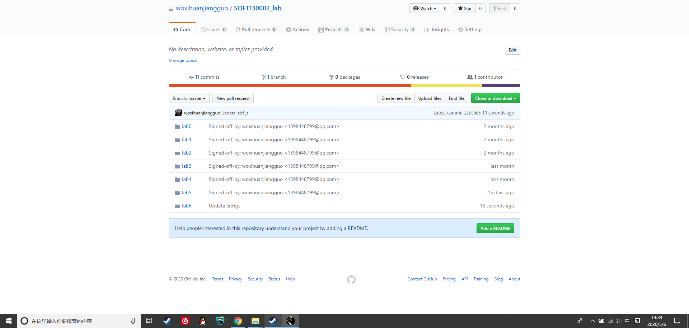

# LAB6
## 个人信息
李臻欣 19302010007  
https://github.com/woxihuanjiangguo/SOFT130002_lab  
  

## 代码具体实现
### 正则表达式
```javascript
//手机电话
    if(/^1[3456789]\d{9}$/.test(telephone)){
        judgeT = true;
    }
//邮箱
    if(/^([a-zA-Z0-9_-])+@([a-zA-Z0-9_-])+((\.[a-zA-Z0-9_-]{2,3}){1,2})$/.test(mail)){
        judgeM = true;
    }
```
以上为问题2的正则表达式。  

手机部分：前后^与$符号表示以此表达式匹配从开头到结尾整个字符串。第一位是1，第二位是方括号中3-9的某一个数字。随后以\d{9}代表任意9个数字，组成11位手机号码。   

邮箱部分：^与$符号同上，匹配整个表达式。()+表示数字、大小写字母、下划线至少出现一次，组成@前面部分。@后面部分先是同样的，数字、大小写字母、下划线至少出现一次，
组成第一个.与@之间的部分。随后(\.[]{2,3})这一部分表示以.开头，后面接着2-3位的字符，这一字符组合。最后(){1,2}表示上述字符组合重复出现1-2次。
  
```javascript
let words = str.split(/ /);
```
以上位问题3中用到的正则表达式。并没有用直接匹配重复单词的字符串，而是先将其split，再依次判断是否重复。这样解决了有三个重复单词只能匹配到一个的问题。（暂时没有想到用一个正则表达式直接解决的方法）  
```javascript
/(| )(\w+) \2(| )/
```
这是最开始写的正则表达式，但是遇到了上述3个重复单词不能全选中的问题。
### 继承方式
```javascript
function DevelopingCountry() {
    Country.call(this);
}
```
构造函数  
使用call方法，调用Country对象，并应用于DevelopingCountry的当前对象。
```javascript
function PoorCountry() {
}
PoorCountry.prototype = new Country();
```
原型  
遵从子类的原型是父类的实例这一原则，完成继承。
```javascript
function DevelopedCountry() {
    Country.call(this);
}
DevelopedCountry.prototype = Object.create(Country.prototype);
```
Object.create方法  
先用call方法，再用此方法创造一个Country.prototype的浅复制，并且赋值给DevelopedCountry.prototype。完成继承。
### 对于JavaScript各种内建对象的使用
Map：储存键值对。在Map集合中搜索某一个键的速度很快。在问题7，找出无重复字符子串最长长度中，字符为键，出现位置为值，
向后匹配过程中，通过比较值与当前最长子串的起始位置，不断更新字符对应的值与子串的起始位置。 

Set：元素唯一。问题4中，将两个字符串都转化为大写，再分别放入两个set集合中。随后用for of循环，如果实际输出中有某一字符，就用delete方法将其从另一个set集合中删去，那么删剩下的为坏掉的键。  

Array：和普通数组比较类似。问题5中，先用regexp分割出单词部分，再用pop与shift方法去除数组首尾的空字符串。

