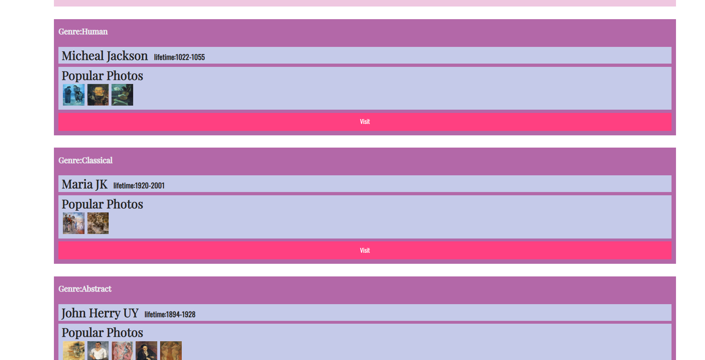

# Lab7
## 个人信息
姓名：李臻欣  
学号：19302010007  
github地址：https://github.com/woxihuanjiangguo/SOFT130002_lab  
## 网页截图

## 设计思路
用document.createElement()方法创建出html的元素，然后用 .className与.innerHTML 为其类与标签的inner值赋值，
最后用一次循环分别把works数组中的值赋给各个元素。   
 
过程中遇到两个问题，一个是为了避免重复代码，想用一个复制对象的方法把基准的div复制，开始时使用了Object.create()方法，发现没有作用，
就改用了.cloneNode()方法。    

另一个问题是如何获取节点中的子节点。这里使用了.children.item()方法。在全部赋值完成后把最终的div加入到document中。考虑是否可以先加入到document，再用.querySelector()这个方法来实现子节点的查询，这样更为方便。  
```javascript
let arr = [itemDiv.cloneNode(true),itemDiv.cloneNode(true),itemDiv.cloneNode(true),itemDiv.cloneNode(true)];

for(let i = 0;i<4;i++){
    arr[i].children.item(0).innerHTML = "Genre:"+ works[i].tips;
    arr[i].children.item(1).children.item(0).innerHTML = works[i].author;
    arr[i].children.item(1).children.item(1).innerHTML = works[i].lifetime;
    for(let j = 0;j<works[i].photos.length;j++){
        let picture = document.createElement("img");
        picture.src = "pics/"+works[i].photos[j];
        picture.className= "photo";
        arr[i].children.item(2).appendChild(picture);
    }
    all.appendChild(arr[i]);
document.querySelector('.flex-container').appendChild(all);
}
```
最后注意到lifetime的样式需要有粗体，与作者名字在同一行，于是在js中写了如下代码：
```javascript
artist.style.display = "inline";
life.style.fontWeight = "bold";
life.style.display = "inline";
life.style.marginLeft = "1%";
```