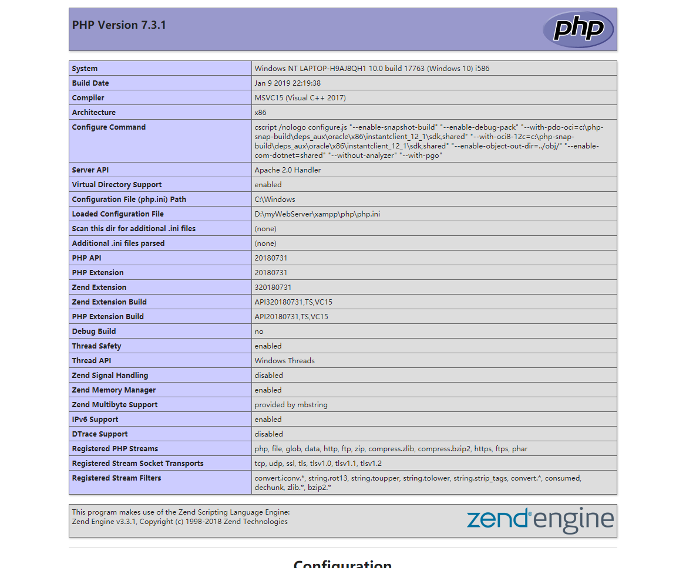
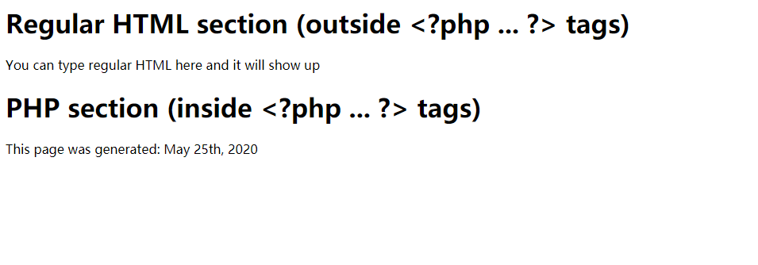
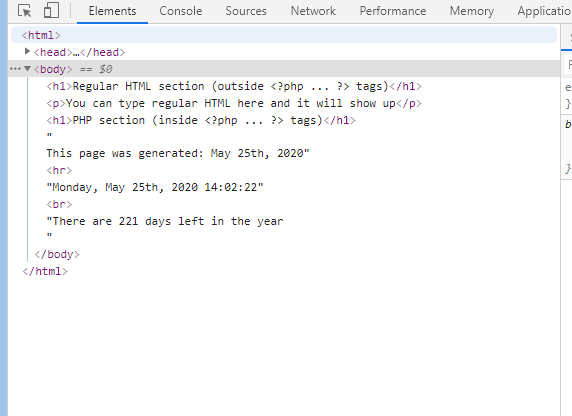
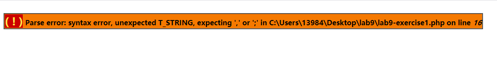
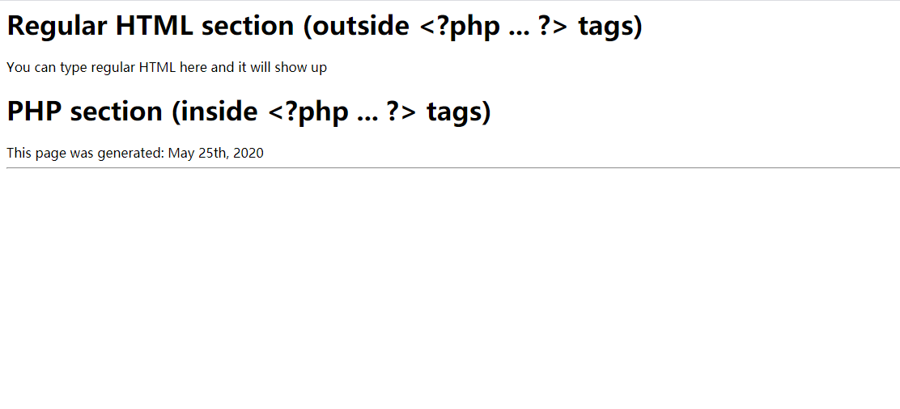
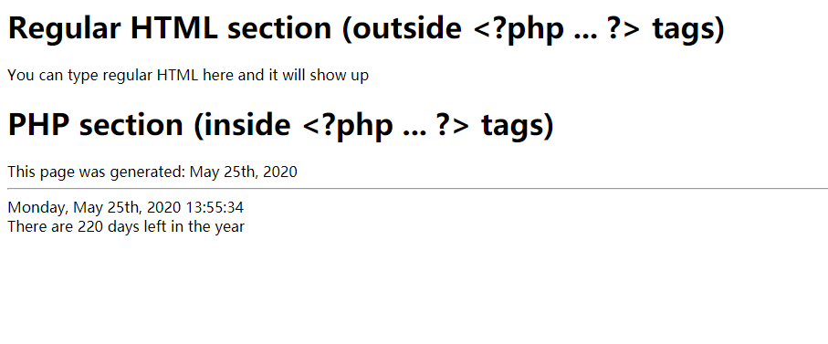
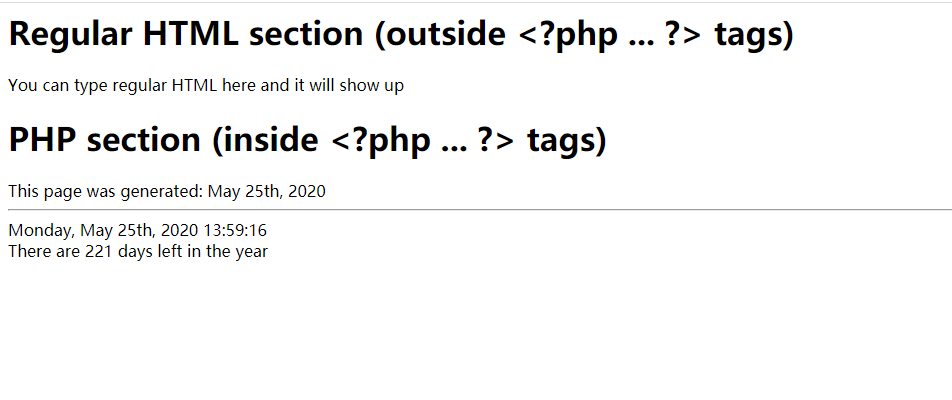

# Lab9
## 个人信息
姓名：李臻欣  
学号：19302010007  
github地址：https://github.com/woxihuanjiangguo/SOFT130002_lab
## 截图与对应的代码
### Ex.0

### Ex.1-2

### Ex.1-3

### Ex.1-4

### Ex.1-5

### Ex.1-7

### Ex.1-8

### Ex.1-9

```php
echo date("l, F dS, Y G:i:s");
```
### Ex.1-10

### Ex.1-11

用date("L")是否为1判断是不是闰年，如果是则加一
```php
if(date("L")==1){
    $remaining = 366 - date("z");
    echo "There are ". $remaining . " days left in the year";
}else{
    $remaining = 365 - date("z");
    echo "There are ". $remaining . " days left in the year";
}
```
